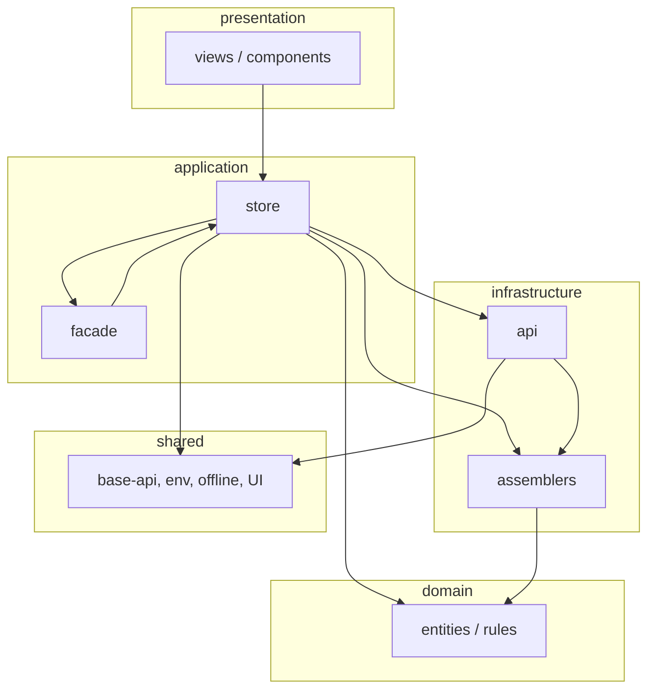

# Arquitectura Frontend — Gastro Suite Web

> **Versión:** 2.0.0 · **2026-06-29**  
> **Stack:** Vue 3 · Vite · Pinia · DDD por módulos  
> **Companion:** [ARCHITECTURE-REMEDIATION-PLAN.md](./ARCHITECTURE-REMEDIATION-PLAN.md) (stub · histórico en [archive/](./archive/)) · [TECHNICAL.md](./TECHNICAL.md)

Este documento es la **referencia canónica** de arquitectura del frontend. Define capas, convenciones, reglas de dependencia, patrones de integración entre módulos (incluido **Facade**) y excepciones documentadas.

---

## 1. Principios

| Principio | Descripción |
|-----------|-------------|
| **Modular monolith** | Cada feature vive en `src/<moduleName>/` con fronteras explícitas. |
| **DDD ligero** | Domain puro, application orquesta, infrastructure adapta HTTP, presentation renderiza. |
| **Un store por módulo** | Pinia store único: `<moduleName>.store.js`. Lógica auxiliar en `application/` pero consumida **solo** por el store. |
| **Sin filtración de DTOs** | Ninguna capa superior a infrastructure recibe JSON crudo del backend de forma habitual. |
| **Presentation delgada** | Las vistas consumen **store** (y constantes UI). No llaman APIs ni assemblers. |
| **Cross-module explícito** | Los acoplamientos entre módulos pasan por **facades** o contratos documentados, nunca por imports directos a `infrastructure/` de otro módulo. |

---

## 2. Taxonomía de módulos

No todos los módulos tienen el mismo rol. Clasificarlos evita forzar patrones incorrectos.

### 2.1 Módulo de dominio (CRUD / operativo)

**Ejemplos:** `menu`, `inventory`, `users`, `branches`, `stations`, `payments`, `cash-register`, `reports`, `tables`, `company`.

| Característica | Detalle |
|----------------|---------|
| Bounded context | Un agregado principal o familia cohesiva (ej. mesas + zonas + reservas → módulo `tables`). |
| Store | Un solo `<module>.store.js`. |
| API | Un `<module>.api.js` (+ sub-APIs solo si el backend expone recursos distintos en el mismo contexto, ej. `tables.api.js` + `reservations.api.js`). |
| Presentation | Rutas propias, vistas CRUD o operativas. |

### 2.2 Módulo agregador (read model / hub)

**Ejemplos:** `dashboard`, `pos` (parcialmente).

Orquesta **lectura** o **flujos transaccionales** que cruzan varios bounded contexts. No duplica dominio ajeno; **compone** datos ya modelados en otros módulos.

| Regla | Detalle |
|-------|---------|
| Facade obligatoria | Toda lectura cross-module pasa por `application/<module>.facade.js` o métodos del store que delegan en facades. |
| Sin assemblers ajenos | El agregador **no** importa `infrastructure/assemblers` de otros módulos. |
| Preferir BFF | Cuando el backend expone un endpoint agregado (ej. `GET /dashboard/operational-metrics`), el módulo agregador usa **su** API + **sus** assemblers. |

### 2.3 Módulo transversal embebido

**Ejemplo:** `communication`.

No tiene rutas de página propias; se integra en el shell (`notifications-bell` en toolbar). Sigue la estructura de capas pero con excepciones documentadas en §8.

### 2.4 Módulo de plataforma (admin SaaS)

**Ejemplo:** `platform`.

Administración Metasoft (planes, empresas, admins). Debe cumplir el mismo contrato de capas que un módulo CRUD: **domain + assemblers obligatorios** (hoy es la brecha principal).

### 2.5 Infraestructura compartida (fuera de módulos)

**`src/shared/`** — HTTP base, env, offline, realtime, composables cross-cutting, componentes UI genéricos. Estructura: `application/`, `domain/`, `infrastructure/`, `presentation/` (composables, components, constants, views). No contiene lógica de negocio de un bounded context.

**`src/public/`** — Shell de aplicación (layout, sidebar, toolbar). **No importa stores de módulos**; consume `useShellFacade()` desde `shared/application/shell.facade.js`.

**`src/router/`** — Composición de rutas; importa `{module}.routes.js` de cada módulo.

---

## 3. Estructura de carpetas por módulo

```
src/<moduleName>/
├── application/
│   ├── <moduleName>.store.js          # Obligatorio — único punto Pinia del módulo
│   ├── <moduleName>.facade.js         # Opcional — orquestación cross-module (agregadores)
│   └── *.helpers.js | *.builder.js    # Opcional — lógica de aplicación; SOLO importada por store/facade
├── domain/
│   ├── models/
│   │   ├── <entity>.entity.js         # Entidades y value objects (preferir .entity.js)
│   │   └── *.vo.js                    # Permitido para VOs de formulario sin identidad (iam)
│   └── *.js                           # Reglas puras (sort, net amount, helpers de dominio)
├── infrastructure/
│   ├── api/
│   │   └── <moduleName>.api.js        # Obligatorio — extiende BaseApi
│   ├── assemblers/
│   │   └── <entity>.assembler.js      # Obligatorio por entidad expuesta al store
│   └── ...                            # guards, sockets, push — permitido con justificación
└── presentation/
    ├── <moduleName>.routes.js         # Obligatorio (excepto transversales embebidos)
    ├── components/
    ├── constants/
    └── views/
```

**No crear** `<module>/presentation/composables/`. Los composables viven **solo** en `shared/presentation/composables/` (ver §3.2). Estado UI local del módulo → `<script setup>` del componente o vista; lógica reutilizable → `application/` vía store.

### 3.1 Reglas estrictas de `presentation/`

| Regla | Detalle |
|-------|---------|
| **Prohibido** `presentation/composables/` | No existe en módulos feature. Usar `shared/presentation/composables/` para UI reutilizable; estado local en el `.vue` |
| **Prohibido** `presentation/utils/` | Toda lógica → `application/*.js`; export Excel/CSV → método del **store** que delega en `application/*-excel.js` |
| **Prohibido** `presentation/helpers/` | → `application/*.helpers.js` o `*.builder.js`; consumido **solo** por store/facade |
| **Cross-module en presentation** | **Prohibido** importar `useOtherModuleStore()`. Solo `use<Module>Store()` propio; datos/acciones de otros bounded contexts vía **`application/<module>.facade.js`** expuesto en el store |
| **Export desde UI** | La vista llama `store.exportXxx()`; nunca importa `application/*-excel.js` directamente |

### 3.2 Composables — solo en `shared/`

Los composables Vue (`use-*`) son **cross-cutting UI** y pertenecen únicamente a:

```
src/shared/presentation/composables/
```

Ejemplos: `use-confirm-dialog`, `use-date-formatter`, `use-operational-bootstrap`, `use-table-pagination`.

**Reglas:**

- Las vistas y componentes de **módulos feature** importan composables desde `shared/presentation/composables/`, nunca definen los suyos en `<module>/presentation/`.
- Composables del shell **no importan stores ajenos directamente**; orquestan vía **`shared/application/shell.facade.js`** (bootstrap, sockets, cambio de sucursal, banners).
- No copies el patrón de composables con stores en módulos feature; usa **facade + store propio**.

### 3.3 Shell facade (`shared/application/shell.facade.js`)

Punto único de orquestación cross-module para **`public/`** y **`shared/presentation/`** (layout, toolbar, banners, bootstrap operativo):

| Consumidor | Import permitido |
|------------|------------------|
| `public/presentation/*` | `shared/application/shell.facade.js`, composables de `shared/presentation/` |
| `shared/presentation/composables/*` | `shared/application/shell.facade.js` (no stores de módulos) |
| `shared/presentation/components/*` (banners shell) | `shared/application/shell.facade.js` |
| `shared/application/shell.facade.js` | stores de cualquier módulo (única capa shell con acceso directo) |

### Carpetas no recomendadas en presentation (remediación)

| Carpeta actual | Destino tras remediación |
|----------------|--------------------------|
| `presentation/composables/` | Inline en `components/` o `views/`; o mover a `shared/presentation/composables/` si es UI genérica |
| `presentation/utils/` | `application/` + método en store |
| `presentation/helpers/` | `application/*.helpers.js` vía store/facade |

---

## 4. Reglas de dependencia

### 4.1 Grafo permitido



### 4.2 Matriz de imports

| Desde → Hacia | domain | application (propio) | application (otro módulo) | infrastructure (propio) | infrastructure (otro) | presentation | shared |
|---------------|--------|----------------------|---------------------------|----------------------|----------------------|--------------|--------|
| **presentation** | ⚠️ evitar | ✅ **solo store propio** | ❌ (usar facade en store propio) | ❌ | ❌ | — | ✅ |
| **application** | ✅ | ✅ | ⚠️ solo facade/store público | ✅ | ❌ | ❌ | ✅ |
| **infrastructure** | ✅ | ❌ | ❌ | ✅ | ❌ | ❌ | ✅ |
| **domain** | ✅ | ❌ | ❌ | ❌ | ❌ | ❌ | ❌ |

**Leyenda:** ✅ permitido · ❌ prohibido · ⚠️ excepción controlada (ver §8).

### 4.3 Prohibiciones absolutas

1. `presentation` → `infrastructure` (propio o ajeno).
2. `presentation` → `assembler` (mover utilidad a domain o store).
3. `application` → `infrastructure` de **otro** módulo.
4. `domain` → cualquier capa externa a domain.
5. Dependencias circulares entre módulos.

---

## 5. Contratos por capa

### 5.1 Domain — `<entity>.entity.js`

```javascript
export class Product {
    constructor({
        id = null,
        name = '',
        isActive = true,
    } = {}) {
        this.id = id;
        this.name = name;
        this.isActive = isActive;
    }
}

// Constantes de dominio exportadas desde la entidad
export const PRODUCT_STATUS = Object.freeze({ ACTIVE: 'ACTIVE', ... });
```

- Sin imports de Vue, Pinia, Axios ni archivos de `infrastructure/` o `presentation/`.
- Value objects de formulario (registro IAM) pueden usar `*.vo.js` con las mismas reglas de pureza.

### 5.2 Infrastructure — API

```javascript
import { BaseApi } from '../../../shared/infrastructure/base-api.js';
import { BaseEndpoint } from '../../../shared/infrastructure/base-endpoint.js';

export class MenuApi extends BaseApi {
    #endpoint;
    constructor() {
        super();
        this.#endpoint = new BaseEndpoint(this, apiEnv.menu);
    }
    // ...
}
```

- **Prohibido** `fetch` / `axios` directo si existe `BaseApi`.
- Paths centralizados en `shared/infrastructure/env.js`.

### 5.3 Infrastructure — Assembler

Contrato **obligatorio** por entidad:

```javascript
export class ProductAssembler {
  static toEntityFromResource(resource) { /* DTO → Entity */ }
  static toEntitiesFromResponse(response) { /* list/paginated → Entity[] */ }
}
```

Métodos adicionales permitidos (no sustituyen los obligatorios):

| Método | Uso |
|--------|-----|
| `toEntityFromResponse(response)` | Wrapper `entityFromResponse` para item único |
| `toCreateResource(entity)` | Entity → body POST |
| `toUpdateResource(entity)` | Entity → body PUT/PATCH |
| `toPageFromResponse(response)` | Paginación con metadata |

**Regla:** el store nunca asigna `response.data` crudo a `ref()` salvo tipos primitivos de metadata (ej. `totalElements` ya parseado por assembler).

### 5.4 Application — Store

```javascript
import { defineStore } from 'pinia';
import { ref } from 'vue';
import { MenuApi } from '../infrastructure/api/menu.api.js';
import { MenuItemAssembler } from '../infrastructure/assemblers/menu-item.assembler.js';

const api = new MenuApi();

export const useMenuStore = defineStore('menu', () => {
    const items = ref([]);
    async function fetchAll() {
        const response = await api.getAll();
        items.value = MenuItemAssembler.toEntitiesFromResponse(response);
    }
    return { items, fetchAll };
});
```

Responsabilidades del store:

| Hace | No hace |
|------|---------|
| Orquestar API + assembler | Renderizar / formatear para UI específica |
| Mantener estado del módulo | Importar constantes de `presentation/` |
| Exponer getters para vistas | Llamar HTTP sin API class |
| Delegar en facade si hay cross-module | Importar assemblers de otros módulos |
| Retornar `{ ok, message }` en mutaciones | Devolver DTOs crudos a presentation |

Helpers en `application/` (`*-display.js`, `*-helpers.js`, `*-builder.js`):

- **Solo** importados por el store o facade del mismo módulo.
- Exportan funciones puras o derivaciones de entidades ya en memoria.
- La presentation los consume **vía getters/actions del store**, no por import directo.

### 5.5 Application — Facade

**Cuándo usar facade:**

| Escenario | Solución |
|-----------|----------|
| Vista necesita datos de 2+ módulos | Facade en el módulo **dueño de la pantalla** |
| Store agregador (dashboard, pos hub) | `<module>.facade.js` encapsula lecturas de otros stores |
| Utilidad hoy en assembler ajeno | Mover a domain del módulo consumidor o método del store proveedor |
| Draft de formulario multi-paso | `application` del módulo (ej. `iam.store` expone `signUpDraft`) |

Plantilla:

```javascript
// pos/application/pos.facade.js
import { useTablesStore } from '../../tables/application/tables.store.js';
import { useMenuStore } from '../../menu/application/menu.store.js';

/**
 * Lecturas compuestas para el hub POS. Solo stores — nunca assemblers externos.
 */
export function usePosFacade() {
    const tablesStore = useTablesStore();
    const menuStore = useMenuStore();

    function tableWithContext(tableId) {
        const table = tablesStore.tableById(tableId);
        if (!table) return null;
        return { table, hasOpenSale: tablesStore.hasOpenSale(tableId) };
    }

    return { tableWithContext };
}
```

El **store** del módulo dueño re-exporta o delega en la facade; las vistas solo usan `usePosStore()`.

```javascript
// pos.store.js — patrón recomendado
import { usePosFacade } from './pos.facade.js';

export const usePosStore = defineStore('pos', () => {
    const facade = usePosFacade();
    // ...
    return {
        tableWithContext: facade.tableWithContext,
    };
});
```

### 5.6 Presentation — Routes

```javascript
const menuManagement = () => import('./views/menu-management.vue');

export default [
    {
        path: '',
        name: 'menu-management',
        component: menuManagement,
        meta: { title: 'Menú', requiresBranch: true },
    },
];
```

- **Lazy loading obligatorio:** `const view = () => import('./views/...')`.
- Todas las rutas del módulo viven en `<module>.routes.js` (no en `router/index.js` salvo redirect global).
- `router/index.js` solo compone layout + spread de rutas hijas.
- **Prohibido** importar `shared/infrastructure` en routes; flags de entorno → meta inyectada en router o store.

### 5.7 Presentation — Views

```javascript
import { useMenuStore } from '../../application/menu.store.js';
import { MENU_LABELS } from '../constants/menu.constants-ui.js';

const store = useMenuStore();
```

- Consumir **store propio** como regla general.
- Constantes de dominio para UI → re-exportar en `presentation/constants/` si la vista las necesita (evita `presentation → domain`).
- Cross-module: preferir datos ya compuestos en store/facade del módulo dueño de la vista.

---

## 6. Patrones de integración cross-module

### 6.1 Lectura desde otro módulo

```
presentation (pos)
    → pos.store
        → pos.facade
            → tables.store (método público documentado)
            → menu.store
```

### 6.2 Escritura coordinada (saga ligera)

Orquestación en el store **iniciador** (ej. `pos.store` al cerrar venta):

1. Validar precondiciones vía stores dependientes.
2. Llamar API propia.
3. Notificar éxito; stores dependientes refrescan vía realtime o `fetch` explícito.

No llamar APIs de otros módulos desde `pos.store` salvo que el backend no ofrezca BFF y esté documentado como deuda.

### 6.3 Eventos realtime

`shared/infrastructure/realtime/operational-event-dispatch.js` enruta a `handleOperationalEvent` de cada store. Los stores no se importan entre sí para realtime.

### 6.4 Matriz de acoplamiento permitido (post-remediación)

| Módulo consumidor | Puede leer store de | Facade | Notas |
|-------------------|---------------------|--------|-------|
| `pos` | tables, menu, stations, payments, cash-register, company, iam | `pos.facade` | Hub transaccional |
| `dashboard` | payments, pos, tables, stations, cash-register, inventory, reservations, iam, branches | `dashboard.facade` | Preferir BFF API |
| `payments` | cash-register, iam | mínimo | Validar sesión de caja |
| `users` | branches, iam | `users.facade` | Selector sucursal en form |
| `tables` | pos | `tables.facade` | Plano mesas en POS |
| `menu` | stations | `menu.facade` | Nombres ítems en estaciones |
| `stations` | menu | `stations.facade` | Nombres ítems en tickets |
| `branches` | users, iam | `branches.facade` | Gestión sucursales |
| `company` | iam, communication | `company.facade` | Suscripción + notificaciones |
| `inventory` | iam | `inventory.facade` | Vínculo empleado |
| `reports` | iam | `reports.facade` | Vínculo empleado |
| `platform` | iam | `platform.facade` | Logout SYSTEM |
| **shell** | todos los necesarios | **`shell.facade`** | `public/` + `shared/presentation` shell |
| Resto | iam (tenant) | — | Solo `requireActiveBranchId` vía shared |

**Nota:** `tables` incluye sub-store `reservations` en el mismo bounded context; prohibir import desde fuera excepto vía `tables.store` / `tables.facade`.

---

## 7. Módulos especiales

### 7.1 `tables` — dos stores, un módulo

`reservations.store.js` es **sub-store interno** del bounded context Mesas. Opciones (elegir una en remediación):

| Opción | Descripción |
|--------|-------------|
| **A (recomendada)** | Fusionar en `tables.store.js` con namespace `reservations` |
| **B** | Mantener dos stores pero documentar como patrón "sub-store"; prohibir import desde fuera excepto vía `tables.store` |

### 7.2 `communication` — transversal

| Aspecto | Convención |
|---------|------------|
| Store | Renombrar a `communication.store.js` (`useCommunicationStore`) |
| Routes | `communication.routes.js` vacío o con comentario de excepción |
| Presentation | Solo `components/` + `constants/` |
| Infra extra | `push/`, `realtime/` justificados en módulo |

### 7.3 `dashboard` — agregador

Prioridad de fuentes de datos:

1. **API BFF** `dashboard.api.js` + assemblers propios (métricas servidor).
2. **Fallback cliente** vía `dashboard.facade` leyendo otros stores.
3. Prohibido: importar `payment-net.js` de payments en presentation; el store expone `paymentRows` ya calculados.

### 7.4 `platform` — admin SaaS

Entidades mínimas sugeridas:

| Entidad | Assembler |
|---------|-----------|
| `PlatformPlan` | `platform-plan.assembler.js` |
| `PlatformCompany` | `platform-company.assembler.js` |
| `SubscriptionRequest` | `subscription-request.assembler.js` |
| `PlatformAdmin` | `platform-admin.assembler.js` |
| `AuditLogEntry` | `audit-log.assembler.js` |

---

## 8. Excepciones controladas

| ID | Excepción | Razón | Alternativa futura |
|----|-----------|-------|-------------------|
| EX-01 | `iam` VOs instanciados en presentation (sign-up) | Formulario multi-paso con estado local | Store expone `createEmptyEmpresa()` factory |
| EX-02 | ~~`public/layout` importa varios stores~~ | Shell de navegación | **Resuelto:** `shared/application/shell.facade.js` |
| EX-03 | Constantes domain en `presentation/constants` re-export | Evita import domain en vistas | Mantener como patrón oficial |
| EX-04 | `shared/presentation/composables` usados en vistas | UI cross-cutting sin negocio | Permitido |
| EX-05 | Sub-APIs en mismo módulo (`tables` + `reservations`) | Backend REST separado | OK dentro de infrastructure |

Toda nueva excepción requiere entrada en esta tabla + aprobación en PR.

---

## 9. Checklist de nuevo módulo

- [ ] `src/<module>/` con las 4 capas
- [ ] `domain/models/<entity>.entity.js` con constructor y defaults
- [ ] `infrastructure/api/<module>.api.js` extends `BaseApi`
- [ ] Un assembler por entidad con `toEntityFromResource` + `toEntitiesFromResponse`
- [ ] `application/<module>.store.js` único
- [ ] `presentation/<module>.routes.js` con lazy loading
- [ ] Sin imports prohibidos (ejecutar auditoría o ESLint boundary rule)
- [ ] Entrada en `router/index.js`
- [ ] Registro en `reset-application-stores.js` si aplica
- [ ] Handler `handleOperationalEvent` si el módulo es branch-scoped realtime

---

## 10. Validación continua

### Auditoría automatizada

```bash
npm run audit:architecture   # capas, shell→foreign-store, carpetas prohibidas
npm run verify:modules       # checklist por módulo feature (15/15)
npm run build:only
```
**Kit de agente (prompts + skills):** [`.cursor/README.md`](../.cursor/README.md)

Re-ejecutar el prompt de auditoría arquitectónica tras cambios estructurales significativos.

### ESLint (recomendado)

Regla `import/no-restricted-paths` o `eslint-plugin-boundaries`:

```javascript
// Ejemplo conceptual
{ target: '**/presentation/**', from: '**/infrastructure/**', message: 'presentation no importa infrastructure' }
{ target: '**/application/**', from: '**/infrastructure/!(shared)/**', except: ['**/application/**'] }
```

### Definition of Done por PR de remediación

1. Cero violaciones `presentation → infrastructure` en el módulo tocado.
2. Store no asigna DTOs crudos.
3. Assemblers cumplen contrato mínimo.
4. Rutas del módulo en `<module>.routes.js`.
5. Documentación actualizada si cambia excepción o facade pública.

---

## 11. Referencias

| Documento | Contenido |
|-----------|-----------|
| [ARCHITECTURE-REMEDIATION-PLAN.md](./ARCHITECTURE-REMEDIATION-PLAN.md) | Stub post-remediación · histórico en [archive/](./archive/) |
| [TECHNICAL.md](./TECHNICAL.md) | Stack, comandos, endpoints |
| [INTEGRATION.md](./INTEGRATION.md) | Contratos API |
| [ACTION-PLAN.md](./ACTION-PLAN.md) | Tracking brechas producto |
