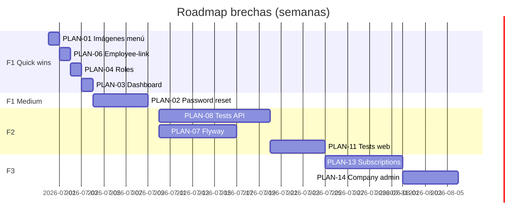

# Plan de Implementación Detallado — Cierre de Brechas

> **Versión:** 2.1 · **2026-06-27 (análisis arquitectónico)**  
> **Companion:** [ACTION-PLAN.md](./ACTION-PLAN.md)  
> **Validación operativa:** `gastro-suite-api/docs/OPERATIONAL-VALIDATION.md`

Este documento es la **guía de ejecución paso a paso**. Cada ítem incluye contexto, dependencias, archivos exactos, contratos, pruebas, riesgos y Definition of Done.

---

## Índice rápido

| ID | Título | Esfuerzo | Repos | Depende de |
|----|--------|----------|-------|------------|
| [PLAN-01](#plan-01--subida-de-imágenes-en-menú) | Imágenes menú | S (2–4h) | web | — |
| [PLAN-02](#plan-02--recuperación-de-contraseña) | Forgot/reset password | L (2–3d) | api+web | — |
| [PLAN-03](#plan-03--dashboard-estrategia) | Dashboard | S–M (4–8h) | web o api+web | — |
| [PLAN-04](#plan-04--catálogo-de-roles) | Roles API | S (2–4h) | web | — |
| [PLAN-05](#plan-05--ruta-reset-password) | Ruta reset | S (1–2h) | web | PLAN-02 |
| [PLAN-06](#plan-06--employee-link-en-reportes) | Employee-link UX | S (2–3h) | web | — |
| [PLAN-07](#plan-07--flyway--baseline) | Flyway | L (3–5d) | api | — |
| [PLAN-08](#plan-08--tests-integración) | Tests API | L (1–2 sem) | api | — |
| [PLAN-09](#plan-09--deprecar-support-api) | Support API | M (2–3d) | api | — |
| [PLAN-10](#plan-10--autorización-declarativa) | @PreAuthorize | M (2–3d) | api | — |
| [PLAN-11](#plan-11--tests-frontend) | Vitest | M (3–5d) | web | — |
| [PLAN-12](#plan-12--typos-package) | Typos | M (1d) o 0 | ambos | decisión |
| [PLAN-13](#plan-13--ui-subscriptions) | Subscriptions UI | L (1 sem) | api+web | PLAN-09 parcial |
| [PLAN-14](#plan-14--gestión-empresa) | Company admin | M (3–5d) | web | — |
| [PLAN-15](#plan-15--admin-user) | User admin | M–L | ambos | producto |
| [PLAN-16](#plan-16--multi-sucursal-ux) | Branch switcher | M (2–3d) | web | — |
| [PLAN-17](#plan-17--diseño-billing) | ADR Billing | L (1 sem) | api | — |
| [PLAN-18](#plan-18--boletafactura-mvp) | SUNAT MVP | XL (4–8 sem) | ambos | PLAN-17 |
| [PLAN-19](#plan-19--notas-de-crédito) | NC | L (2 sem) | ambos | PLAN-18 |
| [PLAN-20](#plan-20--domain-events) | Domain events | L (1–2 sem) | api | — |
| [PLAN-21](#plan-21--refresh-token) | JWT refresh | M (3–5d) | ambos | — |
| [PLAN-22](#plan-22--observabilidad) | Métricas | M (3–5d) | ambos | — |
| [PLAN-23](#plan-23--readme-web) | README web | S (1h) | web | ✅ hecho parcial |
| [PLAN-24](#plan-24--readme-api) | README api | S (1h) | api | — |
| [PLAN-25](#plan-25--canales-pos-delivery--pago-parcial) | Delivery + pago parcial | L (3–5d) | ambos | ✅ |
| [PLAN-26](#plan-26--inventario-movimientos) | Inventario movimientos | M (1–2d) | ambos | ✅ |
| [PLAN-27](#plan-27--auth-tenant-jwt) | Auth tenant JWT | M (1d) | ambos | ✅ |
| [PLAN-28](#plan-28--ux-pos--contraste) | UX POS / contraste | S (2–4h) | web | ✅ |
| [PLAN-29](#plan-29--rbac--tests-tenant) | RBAC + tests tenant | M (2–3d) | api | PLAN-08 |
| [PLAN-30](#plan-30--subscriptionlimitservice) | Límites SaaS | M (3–5d) | api | PLAN-13 |

**Esfuerzo:** S ≤4h · M ≤1 sem · L ≤2 sem · XL >2 sem

---

## PLAN-01 — Subida de imágenes en menú

### Contexto y evidencia

| Aspecto | Detalle |
|---------|---------|
| Brecha | `create-and-edit-menu-item.vue` captura `imageFile`; `menu.store.js` lo descarta en destructuring |
| Backend listo | `PATCH /api/v1/menu-items/{itemId}/image` — `MenuItemBffController.uploadImage()` |
| Contrato backend | `Content-Type: multipart/form-data`, campo **`image`** (`@RequestParam("image")`) |
| Respuesta | `MenuItemBffResource` con URL enriquecida (`itemImageUrl` / similar en assembler) |

### Dependencias

- Ninguna. **Quick win recomendado como primer ítem.**

### Implementación — Frontend

#### Paso 1: API client

**Archivo:** `gastro-suite-web/src/menu/infrastructure/api/menu.api.js`

```javascript
uploadItemImage(itemId, imageFile) {
    const formData = new FormData();
    formData.append('image', imageFile);
    return this.http.patch(`${apiEnv.menuItems}/${itemId}/image`, formData);
}
```

`base-api.js` ya elimina `Content-Type` cuando `data instanceof FormData`.

#### Paso 2: Store — helper privado

**Archivo:** `gastro-suite-web/src/menu/application/menu.store.js`

```javascript
async function applyImageUpload(itemId, imageFile) {
    if (!imageFile || !itemId) return null;
    const response = await api.uploadItemImage(itemId, imageFile);
    return MenuItemAssembler.toEntityFromResponse(response);
}
```

#### Paso 3: Store — `create()`

Después de `createItem` exitoso y `saved?.id`:

1. Si `imageFile`: llamar `applyImageUpload(saved.id, imageFile)`.
2. Reemplazar ítem en `items.value` con entidad que incluye `imageUrl`.
3. Si upload falla: mantener ítem creado pero setear warning en return `{ ok: true, imageWarning: '...' }` (no rollback del ítem).

#### Paso 4: Store — `update()`

Después de `updateItem` exitoso:

1. Si `imageFile`: `applyImageUpload(id, imageFile)` y actualizar `items.value[idx].imageUrl`.

#### Paso 5: UI feedback

**Archivo:** `create-and-edit-menu-item.vue`

- Mostrar toast warning si `imageWarning` en respuesta del store.
- Preview local opcional con `URL.createObjectURL(imageFile)` antes de guardar.

### Implementación — Backend (verificación)

| Check | Acción |
|-------|--------|
| PostImage / storage | Confirmar `ImageStorageService` configurado en dev (`.env.example`) |
| Tamaño máximo | Verificar límite Spring `spring.servlet.multipart.max-file-size` |
| CORS | Multipart no requiere header extra |

**No crear código backend** salvo que falle en prueba manual.

### Pruebas

| Tipo | Caso |
|------|------|
| Manual | Crear ítem con JPG < 2MB → imagen visible en `menu-management.vue` |
| Manual | Editar ítem existente, cambiar imagen → URL actualizada |
| Manual | Crear sin imagen → comportamiento actual intacto |
| Manual | Upload falla (archivo > límite) → ítem existe, mensaje claro |
| Regresión | CRUD sin imagen sigue funcionando |

### Definition of Done

- [ ] `menu.api.uploadItemImage` implementado
- [ ] `create` y `update` en store suben imagen post-persistencia
- [ ] `menu-management.vue` muestra `item.imageUrl`
- [ ] `INTEGRATION.md` fila menú imagen → ✅
- [ ] Changelog en `KNOWLEDGE-BASE.md`

### Riesgos

| Riesgo | Mitigación |
|--------|------------|
| URL imagen relativa vs absoluta | Verificar assembler mapea campo correcto del BFF |
| Orden create→upload | Siempre upload **después** de tener UUID real |

---

## PLAN-02 — Recuperación de contraseña

### Contexto y evidencia

| Aspecto | Detalle |
|---------|---------|
| Frontend | `forgot-password.vue` funcional en UI; `iam.store.forgotPassword()` línea 258–260 retorna error fijo |
| Backend | **No existen** endpoints forgot/reset (grep en `userandroles` sin matches) |
| Ruta huérfana | `IAM_ROUTES.RESET_PASSWORD = '/reset-password'` sin route ni componente |
| Password VO | `Password.java` — min 8, max 200 chars; validación reutilizable |

### Diseño propuesto

```
[Usuario] → POST /auth/forgot-password { email }
         → Backend genera token UUID + expiry (tabla password_reset_token)
         → Email (dev: log URL) con link ?token=...

[Usuario] → GET /reset-password?token=... (solo web)
         → POST /auth/reset-password { token, newPassword }
         → Backend valida token, hashea password, invalida token
```

### Dependencias

- PLAN-05 (ruta reset) se completa dentro de este ítem.

### Implementación — Backend

#### Paso 1: Modelo de dominio

**Nuevo agregado o entidad** en `userandroles`:

```
PasswordResetToken
  - id: UUID
  - userId: UUID
  - tokenHash: String (no guardar token plain)
  - expiresAt: Instant
  - usedAt: Instant nullable
```

**Archivos a crear:**

- `userandroles/domain/model/entities/PasswordResetToken.java`
- `userandroles/infrastructure/persistence/jpa/repositories/PasswordResetTokenRepository.java`

#### Paso 2: Use cases

| Use case | Command |
|----------|---------|
| `RequestPasswordResetCommandUseCase` | email → busca User por username/email → crea token → envía notificación |
| `ResetPasswordCommandUseCase` | token + newPassword → valida → `User.updateUser(..., hashed, ...)` → marca token usado |

**Archivos:**

- `domain/model/commands/RequestPasswordResetCommand.java`
- `domain/model/commands/ResetPasswordCommand.java`
- `application/internal/commandservices/usecases/RequestPasswordResetCommandUseCase.java`
- `application/internal/commandservices/usecases/ResetPasswordCommandUseCase.java`

#### Paso 3: Email (dev)

**Interfaz:** `shared/domain/services/NotificationService` o `EmailService`

**Dev impl:** `LoggingEmailService` — logea `http://localhost:5173/reset-password?token={rawToken}`

**Prod impl:** (fase posterior) SMTP / SendGrid — configurar en `application-prod.yml`

#### Paso 4: REST

**Archivo:** extender `AuthenticationController.java`

| Método | Path | Auth | Body |
|--------|------|------|------|
| POST | `/api/v1/auth/forgot-password` | Public | `{ "email": "user@..." }` |
| POST | `/api/v1/auth/reset-password` | Public | `{ "token": "...", "password": "..." }` |

**Seguridad:**

- Forgot-password **siempre responde 200** aunque email no exista (anti-enumeration).
- Rate limit (fase posterior): por IP.

**Archivos:**

- `interfaces/rest/resources/ForgotPasswordResource.java`
- `interfaces/rest/resources/ResetPasswordResource.java`
- `interfaces/internal/auth/ForgotPasswordEndpoint.java`
- `interfaces/internal/auth/ResetPasswordEndpoint.java`

#### Paso 5: WebSecurity

Agregar a `permitAll`:

```java
.requestMatchers(HttpMethod.POST, "/api/v1/auth/forgot-password").permitAll()
.requestMatchers(HttpMethod.POST, "/api/v1/auth/reset-password").permitAll()
```

#### Paso 6: Tests

- Unit: token expiry, password validation, token single-use
- Integration: forgot → reset → sign-in con nueva password

### Implementación — Frontend

#### Paso 1: API

**Archivo:** `iam/infrastructure/api/iam.api.js`

```javascript
forgotPassword(email) {
    return this.#auth.postAt(`${this.#auth.endpointPath}/forgot-password`, { email });
}
resetPassword(token, password) {
    return this.#auth.postAt(`${this.#auth.endpointPath}/reset-password`, { token, password });
}
```

#### Paso 2: Store

**Archivo:** `iam/application/iam.store.js`

Reemplazar stub:

```javascript
async function forgotPassword(email) {
    isLoading.value = true;
    error.value = null;
    try {
        await iamApi.forgotPassword(email);
        return true;
    } catch (e) {
        error.value = getApiErrorMessage(e, 'No se pudo enviar el enlace');
        return false;
    } finally {
        isLoading.value = false;
    }
}
```

Pasar `email` desde `forgot-password.vue` (hoy no lo envía — **bug adicional**).

#### Paso 3: Vista reset-password

**Crear:** `iam/presentation/views/reset-password.vue`

- Leer `token` de `route.query.token`
- Form: nueva contraseña + confirmación
- Submit → `iamApi.resetPassword` → redirect `/sign-in` con mensaje éxito

#### Paso 4: Rutas

**Archivo:** `iam/presentation/iam.routes.js`

```javascript
{
    path: IAM_ROUTES.RESET_PASSWORD,
    name: 'reset-password',
    component: () => import('./views/reset-password.vue'),
    meta: { title: 'Restablecer Contraseña', requiresAuth: false },
}
```

#### Paso 5: Guard

**Archivo:** `authentication.guard.js` — agregar `/reset-password` a rutas públicas.

### Definition of Done

- [ ] Tabla `password_reset_token` creada (Hibernate o Flyway si PLAN-07 avanzó)
- [ ] Endpoints públicos documentados en Scalar
- [ ] Flujo completo en dev con log de URL
- [ ] `forgot-password.vue` envía email al store
- [ ] `reset-password.vue` operativo
- [ ] PLAN-05 cerrado automáticamente

### Riesgos

| Riesgo | Mitigación |
|--------|------------|
| User lookup por email vs username | Verificar si `User` tiene email o solo username; adaptar campo del form |
| Token en URL | HTTPS obligatorio en prod; token one-time + expiry 1h |

---

## PLAN-03 — Dashboard estrategia

### Contexto

| Componente | Estado |
|------------|--------|
| `dashboard.store.js` | Agrega 5 stores (payments, pos, tables, stations, cash-register) |
| `dashboard.api.js` | CRUD `/dashboard` — **nunca importado** |
| Backend | No existe módulo dashboard |

### Decisión recomendada (Opción A — corto plazo)

**Mantener agregación client-side** y eliminar código muerto. Motivo: dashboard ya funciona; métricas derivadas de datos ya cargados; evita duplicar lógica backend de reportes.

### Implementación — Opción A (recomendada)

| Paso | Archivo | Acción |
|------|---------|--------|
| 1 | `dashboard/infrastructure/api/dashboard.api.js` | **Eliminar** |
| 2 | `dashboard/infrastructure/assemblers/dashboard-metric.assembler.js` | Eliminar si no se usa |
| 3 | `dashboard/domain/models/dashboard-metric.entity.js` | Eliminar si no se usa |
| 4 | `shared/infrustructure/env.js` | Quitar `dashboard: readEnv('VITE_DASHBOARD_ENDPOINT', '/dashboard')` |
| 5 | `.env.example` | Quitar `VITE_DASHBOARD_ENDPOINT` |
| 6 | `docs/TECHNICAL.md` (web) | Documentar patrón read-model aggregator |
| 7 | `KNOWLEDGE-BASE.md` | Registrar decisión ADR-lite en changelog |

### Implementación — Opción B (si se necesita performance)

**Nuevo BFF:** `bff/dashboard/`

```
GET /api/v1/branches/{branchId}/dashboard/metrics?date=YYYY-MM-DD
```

**Response propuesto:**

```json
{
  "todayRevenue": 1250.50,
  "todayPaymentCount": 42,
  "todayByMethod": { "cash": 800, "card": 450.50 },
  "occupiedTables": 8,
  "activeOrders": 3,
  "kitchenReadyCount": 2,
  "cashSessionOpen": true,
  "sessionExpectedCash": 5000.00
}
```

**Backend:** reutilizar ACL de orders/payments/branches; **no** duplicar lógica de `GenerateDailySalesDataUseCase`.

**Frontend:** refactor `dashboard.store.fetchAll()` → una llamada + fallback a agregación si offline.

### Definition of Done

- [ ] ADR o nota en KNOWLEDGE-BASE con opción elegida
- [ ] Sin referencias a `/dashboard` inexistente
- [ ] Dashboard home sigue mostrando métricas

---

## PLAN-04 — Catálogo de roles

### Contexto

| Backend | `GET /api/v1/roles` → `RolesSupportController` (JWT) |
| Frontend | `ROLES` y `USER_ROLE_OPTIONS` hardcoded en `roles.constants.js`, `users.constants-ui.js` |

### Opciones

**A — Fetch al boot (recomendado):** cache en IAM store, fallback a constantes si API falla.

**B — Test de paridad:** test CI compara enum backend vs frontend (sin runtime fetch).

### Implementación — Opción A

#### Paso 1: API

**Archivo nuevo o extensión:** `iam/infrastructure/api/roles.api.js`

```javascript
list() { return this.http.get('/roles'); }
```

#### Paso 2: IAM store

```javascript
const rolesCatalog = ref([]);
async function loadRolesCatalog() {
    try {
        const res = await rolesApi.list();
        rolesCatalog.value = RoleAssembler.toEntities(res);
    } catch {
        rolesCatalog.value = Object.values(ROLES); // fallback
    }
}
```

Llamar en `signIn` post-auth o en `layout.vue` onMounted.

#### Paso 3: Users module

**Archivo:** `users/presentation/constants/users.constants-ui.js`

- `USER_ROLE_OPTIONS` computed desde `rolesCatalog` en lugar de array fijo.

#### Paso 4: Guard de paridad

Test (PLAN-11): snapshot de nombres de roles backend === frontend constants.

### Definition of Done

- [x] UI de creación usuario muestra roles del API
- [x] Fallback documentado si API cae
- [x] `hasRouteAccess` sigue usando `ROLE_ALLOWED_ROUTES` (mapping estático OK — roles no cambian frecuentemente)

---

## PLAN-05 — Ruta reset-password

**Se implementa dentro de PLAN-02.** Si PLAN-02 se difiere, eliminar constante `RESET_PASSWORD` de `iam.routes.js` y referencias en guard hasta que exista backend.

---

## PLAN-06 — Employee-link en reportes

### Contexto

```javascript
// reports.store.js generate()
const employeeId = iamStore.currentUser?.employeeId;
if (!employeeId) {
    error.value = REPORTS_MESSAGES.EMPLOYEE_LINK_REQUIRED;
    return false;
}
```

Banner `employee-link-status-banner.vue` solo visible para `missing_company` y `error`, **no** para falta de `employeeId` en user object.

### Implementación

| Paso | Archivo | Acción |
|------|---------|--------|
| 1 | `iam.store.js` | Exponer computed `hasEmployeeLink` = `!!currentUser?.employeeId` |
| 2 | `employee-link-status-banner.vue` | Ampliar condición: rutas `/reports` + `!hasEmployeeLink` |
| 3 | `reports-home.vue` | Deshabilitar botón "Generar" si `!hasEmployeeLink`; tooltip explicativo |
| 4 | `reports.constants-ui.js` | Mensaje unificado con banner |
| 5 | Manual | Usuario sin employee → banner + botón disabled; tras `ensureEmployeeLink` → generar OK |

### Definition of Done

- [x] UX clara antes de intentar generate()
- [x] No error críptico solo en store

---

## PLAN-07 — Flyway + baseline schema

### Contexto

- `spring.flyway.enabled: false`
- `ddl-auto: update` (dev), `validate` (prod)
- Sin carpeta `db/migration`

### Implementación

#### Fase 1: Baseline

| Paso | Acción |
|------|--------|
| 1 | Levantar DB limpia con app actual → export schema (`pg_dump --schema-only`) |
| 2 | Crear `src/main/resources/db/migration/V1__baseline.sql` |
| 3 | En dev existente: `flyway baseline -baselineVersion=1` |

#### Fase 2: Config

**application.yml:**

```yaml
spring:
  flyway:
    enabled: true
    baseline-on-migrate: true
  jpa:
    hibernate:
      ddl-auto: validate  # todos los profiles tras baseline
```

#### Fase 3: Proceso ongoing

- Toda change DDL → nueva migración `V2__...sql`
- Prohibido `ddl-auto: update` en cualquier profile

#### Fase 4: CI

- Testcontainers ejecuta migrate antes de integration tests

### Definition of Done

- [ ] Fresh install solo con Flyway crea schema funcional
- [ ] `./mvnw test` pasa
- [ ] Documentado en TECHNICAL.md

### Riesgos

| Riesgo | Mitigación |
|--------|------------|
| Drift schema prod vs baseline | Export desde prod staging antes de baseline |
| Hibernate naming strategy | Incluir en V1 exactamente lo que genera `SnakeCaseWithPluralizedTablePhysicalNamingStrategy` |

---

## PLAN-08 — Tests integración flujos críticos

### Base existente

- `ControllerIntegrationTestBase.java`
- `AbstractIntegrationTest.java`
- Testcontainers PostgreSQL

### Suites prioritarias

#### TEST-INT-01: Register owner

```
POST /auth/register-owner → 201
GET /companies/{id}/branches → 200 (si incluye branch en registro)
POST /auth/sign-in → 200 + JWT
```

#### TEST-INT-02: POS checkout

```
Setup: company, branch, user CASHIER, open cash session, menu item, sale OPEN
POST /pos/sales/{id}/checkout → 200
GET /pos/sales/{id} → saleStatus PAID
GET /payments → contains payment
```

#### TEST-INT-03: Cash session lifecycle

```
POST /cash-register/sessions/open → 201
GET .../sessions/open → sessionId
POST /cash-register/sessions/close → 200
```

#### TEST-INT-04: Payment refund

```
Setup: payment existente
POST /payments/{id}/refunds/preview → 200
POST /payments/{id}/refunds → 201
```

**Ubicación sugerida:** `src/test/java/.../bff/sales/SaleCheckoutIntegrationTest.java` etc.

### Definition of Done

- [ ] 4 clases integration test verdes en `./mvnw test`
- [ ] Documentar en README cómo correr con Docker

---

## PLAN-09 — Deprecar API `/support/*`

### Contexto

~90 endpoints duplicados. Web confirmado: **0 consumos**.

### Implementación

| Paso | Acción |
|------|--------|
| 1 | Crear `docs/API-POLICY.md`: BFF = frontend; support = admin interno / deprecating |
| 2 | Agregar `@Deprecated` en controllers support + tag OpenAPI `deprecated: true` |
| 3 | Header response `Sunset: ...` (opcional) |
| 4 | Log warn en support controllers (filtro o aspect) |
| 5 | Timeline: eliminar en v2.0 |

**No eliminar código aún** — solo marcar.

### Definition of Done

- [ ] Scalar muestra support como deprecated
- [ ] KNOWLEDGE-BASE actualizado

---

## PLAN-10 — Autorización declarativa

### Implementación

**Archivo:** `WebSecurityConfiguration` ya tiene `@EnableMethodSecurity`.

Agregar en controllers BFF sensibles:

```java
@PreAuthorize("@operationalAuthorization.hasAnyRole(T(...Roles).OWNER, ...)")
```

O custom bean:

```java
@PreAuthorize("@operationalAuth.canManageCashSession()")
```

**Controllers objetivo:**

- `CashRegisterSessionController`
- `PaymentBffController` (create, refund)
- `CashMovementBffController`
- `ReservationBffController`

**Mantener** llamadas en services como defensa en profundidad.

### Definition of Done

- [ ] 403 JSON consistente si rol incorrecto (ya via AccessDeniedException)
- [ ] Tests unitarios OperationalAuthorizationService (ya existen) + 1 integration 403

---

## PLAN-11 — Tests frontend (Vitest)

### Setup

```bash
npm install -D vitest @vue/test-utils jsdom
```

**package.json:**

```json
"scripts": { "test": "vitest run", "test:watch": "vitest" }
```

**vite.config.js:** bloque `test: { environment: 'jsdom' }`

### Suites prioritarias

| Archivo test | Qué valida |
|--------------|------------|
| `iam/infrastructure/authentication.guard.spec.js` | redirect sin token, role denied, branch required |
| `pos/application/pos-offline-sync.spec.js` | queue + replay idMap |
| `payments/domain/payment-net.spec.js` | cálculo net collected |
| `shared/presentation/constants/roles.constants.spec.js` | paridad roles |

### Definition of Done

- [ ] `npm test` pasa local y CI
- [ ] ≥3 suites

---

## PLAN-12 — Typos package

### Decisión requerida

| Opción | Esfuerzo | Acción |
|--------|----------|--------|
| Mantener | 0 | Documentar en KNOWLEDGE-BASE como convención permanente |
| Refactor | ~1 día | Mover `intefaces` → `interfaces`, `infrustructure` → `infrastructure` con IDE refactor + grep |

**Recomendación:** Mantener hasta v2.0 unless new major refactor sprint.

---

## PLAN-13 — UI Subscriptions

### Contexto crítico

```java
@Profile("dev")  // SubscriptionController Y CompanySubscriptionController
```

**En producción estos endpoints NO EXISTEN hoy.** PLAN-13 requiere **primero** quitar `@Profile("dev")` o crear BFF subscriptions sin profile restriction.

### Backend previo

| Paso | Archivo | Acción |
|------|---------|--------|
| 1 | `SubscriptionController.java` | Quitar `@Profile("dev")` o mover a BFF |
| 2 | Evaluar si subscriptions deben ser BFF-only | Crear `bff/subscriptions/` si orquesta company context |
| 3 | Tests integration subscriptions | CRUD básico |

### Frontend — nuevo módulo `subscriptions/`

```
subscriptions/
  domain/models/subscription.entity.js
  application/subscriptions.store.js
  infrastructure/api/subscriptions.api.js
  presentation/views/subscriptions-management.vue
  presentation/subscriptions.routes.js
```

**Ruta:** `/subscriptions` — solo `OWNER` en `ROLE_ALLOWED_ROUTES`.

**API calls:**

| Operación | Endpoint |
|-----------|----------|
| List plans | `GET /subscriptions` |
| Assign to company | `POST /subscriptions/companies` |
| Update | `PATCH /subscriptions/companies/{companyId}` |

### Definition of Done

- [ ] Endpoints disponibles en prod profile
- [ ] UI OWNER funcional
- [ ] INTEGRATION.md actualizado

---

## PLAN-14 — Gestión empresa post-onboarding

### Backend existente

- `GET /companies/{id}` — JWT
- `PATCH /companies/{id}` — JWT
- `DELETE /companies/{id}` — JWT

### Frontend

**Opción A:** sección en `/branches` o nuevo `/company-settings`

**Archivos nuevos:**

- `companies/infrastructure/api/companies.api.js` (o extender `iam.api.js`)
- `companies/application/company.store.js`
- `companies/presentation/views/company-settings.vue`

**Campos editables:** ver `CompanyResource` / `UpdateCompanyResource` en backend (RUC, razón social, dirección fiscal, etc.)

### Definition of Done

- [ ] OWNER edita empresa y persiste
- [ ] Validaciones backend reflejadas en formulario

---

## PLAN-15 — Admin entidad User

### Contexto

- Web gestiona **Employee** (`/employees`)
- Backend **User** (`/support/users`) — username, password, roles a nivel cuenta

### Decisión producto (requerida)

| Escenario | Implementación |
|-----------|----------------|
| Admin cambia password empleado | Extender Employee BFF con `PATCH /employees/{id}/credentials` |
| Admin desactiva cuenta | `PATCH /support/users/{id}` `{ isActive: false }` |
| Auto-servicio password | PLAN-02 |

### Si se aprueba admin mínimo

- BFF endpoint (no exponer support directo)
- UI en `user-detail-dialog.vue` — tab "Cuenta"

---

## PLAN-16 — Multi-sucursal OWNER UX

### Archivos a revisar

| Archivo | Verificar |
|---------|-----------|
| `public/presentation/components/branch-switcher.vue` | Cambio branch → remount views |
| `layout.vue` | `:key="activeBranchId"` en router-view |
| `reset-application-stores.js` | ¿Resetea stores al cambiar branch? |
| Cada store `fetchAll()` | Reacciona a watch branch en layout/bootstrap |

### Implementación

| Paso | Acción |
|------|--------|
| 1 | Al `selectBranch()`: llamar `resetApplicationStores()` excepto iam — **o** `fetchAll()` en stores activos |
| 2 | Confirm dialog si POS tiene outbox pendiente |
| 3 | Test manual: cambiar branch en POS mid-order → comportamiento definido |

### Definition of Done

- [ ] Documentar comportamiento esperado en KNOWLEDGE-BASE
- [ ] Sin datos stale de branch anterior en UI

---

## PLAN-17 — Diseño bounded context Billing

### Entregable: ADR

**Archivo:** `docs/adr/001-billing-sunat-bounded-context.md`

**Contenido mínimo:**

1. Contexto y requisitos SUNAT (boleta, factura, NC, ND)
2. Agregados propuestos: `ElectronicDocument`, `DocumentSeries`, `TaxLine`
3. Integración OSE vs directo SUNAT
4. Relación con `Payment` y `Sale` (evento `SalePaid`)
5. Idempotencia y numeración correlativa
6. Almacenamiento XML/CDR
7. Fases MVP vs completo

### Definition of Done

- [ ] ADR revisado por equipo
- [ ] README API actualizado (PLAN-24)

---

## PLAN-18 — Boleta/factura MVP

**Depende PLAN-17.** Estimación 4–8 semanas. No detallar implementación hasta ADR aprobado.

**Hitos:**

1. Módulo `billing/` con estructura estándar
2. Emisión boleta desde `SaleCheckoutBffService` (hook post-PAID)
3. UI: tipo comprobante en `pos-payment.vue`
4. Ambiente SUNAT beta

---

## PLAN-19 — Notas de crédito

**Depende PLAN-18.** Vincular `PaymentRefund` → `CreditNote` aggregate.

---

## PLAN-20 — Domain events

### Implementación Spring

```java
// En agregado Sale al marcar PAID:
registerEvent(new SalePaidDomainEvent(saleId, branchId));

// Handler async:
@TransactionalEventListener
void onSalePaid(SalePaidDomainEvent e) {
    realtimeNotifier.saleUpdated(...);
}
```

**Eventos candidatos:** `SalePaid`, `TicketReady`, `CashSessionClosed`

**Archivos:** `shared/domain/events/`, handlers en cada contexto o `shared/application/eventhandlers/`

---

## PLAN-21 — Refresh token JWT

### Diseño

| Token | TTL | Storage |
|-------|-----|---------|
| Access | 15 min | memory / sessionStorage |
| Refresh | 7 días | httpOnly cookie o localStorage |

**Endpoints:**

- `POST /auth/refresh` — body `{ refreshToken }` → new access
- `POST /auth/logout` — invalidate refresh

**Frontend:** interceptor axios retry en 401 si refresh válido.

---

## PLAN-22 — Observabilidad

### Backend

- Micrometer counters: `gastro.checkout.success`, `gastro.checkout.failure`
- Timer checkout duration

### Frontend

- Log estructurado en `pos-offline-sync.js`: `{ event: 'outbox_replay', replayed, failed }`
- Opcional: Sentry / LogRocket

---

## PLAN-23 — README web

**Estado:** parcialmente completado 2026-06-27.

- [x] Setup, env, deploy
- [ ] Agregar link a IMPLEMENTATION-PLAN.md

---

## PLAN-24 — Alinear README API

**Archivo:** `gastro-suite-api/README.md`

| Sección | Cambio |
|---------|--------|
| Características | Marcar SUNAT como **Roadmap** |
| Contextos | Billing → "Planificado" |
| Documentación | Links a docs/ |

---

## PLAN-25 — Canales POS: delivery + pago parcial

**Estado:** ✅ Completado 2026-06-27

Ver `docs/DELIVERY-FLOW.md` (repo api). Frontend: POS terminal/order/payment, filtros hub.

---

## PLAN-26 — Inventario movimientos

**Estado:** ✅ Completado 2026-06-27

Web: editar/eliminar movimientos, banner stock bajo.

---

## PLAN-27 — Auth tenant JWT

**Estado:** ✅ Completado 2026-06-27 · **Validación manual pendiente**

Web: `base-api.js`, `iam.store.js`, `roles.api.js`.

---

## PLAN-28 — UX POS / contraste

**Estado:** ✅ Completado 2026-06-27

`surface-text.css`, header delivery, fixes meta panel.

---

## PLAN-29 — RBAC + tests tenant

**Estado:** Pendiente.

---

## PLAN-30 — SubscriptionLimitService

**Estado:** Pendiente.

---

## Orden de ejecución recomendado



**Sprint 1 (esta semana):** PLAN-01 → PLAN-06 → PLAN-04 → PLAN-03  
**Sprint 2:** PLAN-02 (+ PLAN-05)  
**Sprint 3–4:** PLAN-07 + PLAN-08 + PLAN-11 en paralelo

---

## Plantilla para nuevos ítems

```markdown
## PLAN-XX — Título

### Contexto y evidencia
### Dependencias
### Implementación — Backend (pasos numerados)
### Implementación — Frontend (pasos numerados)
### Pruebas
### Definition of Done
### Riesgos
```

---

## Referencias

- [ACTION-PLAN.md](./ACTION-PLAN.md) — tracking
- [KNOWLEDGE-BASE.md](./KNOWLEDGE-BASE.md)
- [TECHNICAL.md](./TECHNICAL.md)
- `gastro-suite-web/docs/INTEGRATION.md`
