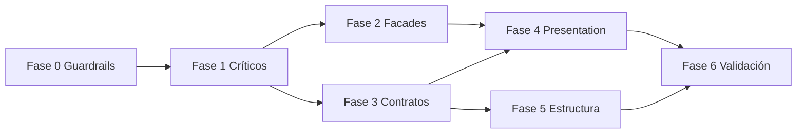

# Plan de Remediación Arquitectónica — Gastro Suite Web

> **ARCHIVO HISTÓRICO** — No editar para nuevas reglas. Vigente: [ARCHITECTURE.md](../ARCHITECTURE.md) · Stub: [ARCHITECTURE-REMEDIATION-PLAN.md](../ARCHITECTURE-REMEDIATION-PLAN.md) · Seguimiento: [ACTION-PLAN.md § PLAN-36](../ACTION-PLAN.md#plan-36--remediación-ddd-frontend-web)

> **Versión:** 1.1.0 · **2026-06-29**  
> **Origen:** Auditoría arquitectónica 2026-06-29  
> **Arquitectura canónica:** [ARCHITECTURE.md](./ARCHITECTURE.md)  
> **Estado global:** ✅ **EJECUTADO** (2026-06-29) — ver validación abajo

### Resultado de la remediación

| Validación | Estado |
|------------|--------|
| `npm run audit:architecture` | ✅ sin violaciones |
| `npm run verify:modules` | ✅ 15/15 módulos feature |
| `npm run build:only` | ✅ OK |
| Shell facade | ✅ `shared/application/shell.facade.js` (EX-02 cerrada) |
| Facades cross-module | ✅ pos, dashboard, users, tables, menu, stations, branches, company, inventory, reports, platform |

> **Nota:** Este documento conserva el plan original por fases como referencia histórica. Para reglas vigentes usar [ARCHITECTURE.md](./ARCHITECTURE.md) §3–§3.3 y §8.

---

## 1. Objetivo

Elevar el cumplimiento arquitectónico del **81 %** actual a **≥ 95 %** en módulos operativos, resolviendo:

1. Violaciones `presentation → infrastructure`
2. Ausencia de domain/assemblers en `platform`
3. Acoplamiento cross-module sin facade (`pos`, `dashboard`)
4. Desalineación de naming y contratos de assembler
5. Helpers de application consumidos directamente desde presentation

**Estrategia central:** introducir **facades en application** para módulos agregadores y hubs; **nunca** importar infrastructure de otro módulo.

---

## 2. Resumen de fases

| Fase | Nombre | Duración est. | Módulos | Objetivo cumplimiento |
|------|--------|---------------|---------|------------------------|
| **0** | Fundamentos y guardrails | 2–3 días | transversal | Reglas enforceables |
| **1** | Violaciones críticas | 3–5 días | platform, iam, pos | Eliminar anti-patrones graves |
| **2** | Facades — hubs | 5–8 días | pos, dashboard | Cross-module controlado |
| **3** | Contratos y naming | 4–6 días | communication, tables, dashboard, todos | Assemblers + stores |
| **4** | Presentation delgada | 4–5 días | cash-register, dashboard, payments, menu, … | Solo store en vistas |
| **5** | Estructura y rutas | 2–3 días | branches, platform, communication | Árbol y routes |
| **6** | Validación y cierre | 2 días | todos | Auditoría ≥ 95 % |

**Duración total estimada:** 3–4 semanas (1 dev senior) o 2 semanas (2 devs en paralelo desde Fase 2).

---

## 3. Dependencias entre fases



---

## Fase 0 — Fundamentos y guardrails

**Objetivo:** Documentación aprobada + detección automática de regresiones.

| ID | Tarea | Archivos | Esfuerzo |
|----|-------|----------|----------|
| ARC-00-01 | Aprobar [ARCHITECTURE.md](./ARCHITECTURE.md) en equipo | docs | S |
| ARC-00-02 | Añadir reglas ESLint `import/no-restricted-paths` | `.eslintrc` o `eslint.config.js` | M |
| ARC-00-03 | Script `npm run audit:architecture` (grep checks) | `scripts/audit-architecture.mjs` | S |
| ARC-00-04 | Enlazar docs en README y TECHNICAL.md §17 | `docs/TECHNICAL.md`, `README.md` | S |

### Reglas ESLint prioritarias

```
presentation/**  →  prohibido **/infrastructure/**
presentation/**  →  prohibido **/assemblers/**
application/**   →  prohibido **/<otro-modulo>/infrastructure/**
domain/**        →  prohibido todo excepto domain/**
```

### Definition of Done — Fase 0

- [ ] PR con docs mergeado
- [ ] CI falla si `presentation` importa `infrastructure` de cualquier módulo
- [ ] Equipo alineado en taxonomía §2 de ARCHITECTURE.md

---

## Fase 1 — Violaciones críticas

**Objetivo:** `platform` NON-COMPLIANT → PARTIALLY; eliminar imports prohibidos en `iam` y `pos`.

### ARC-1-01 — Platform: capa domain + assemblers

| Campo | Detalle |
|-------|---------|
| **Problema** | Store persiste DTOs crudos; sin domain ni assemblers |
| **Solución** | Crear entidades §7.4 de ARCHITECTURE.md + assemblers con contrato estándar |
| **Archivos** | `platform/domain/models/*`, `platform/infrastructure/assemblers/*`, `platform/application/platform.store.js` |
| **Esfuerzo** | L (2–3 días) |
| **Facade** | No — módulo CRUD/admin |

**Pasos:**

1. Modelar entidades: `PlatformPlan`, `PlatformCompany`, `SubscriptionRequest`, `PlatformAdmin`, `AuditLogEntry`, `PlatformDashboard`.
2. Crear un assembler por entidad.
3. Refactorizar cada action del store: `ref([])` recibe `Entity[]`, nunca `data` crudo.
4. Tests manuales: planes, empresas, solicitudes, admins, audit log.

### ARC-1-02 — Platform routes sin infrastructure

| Campo | Detalle |
|-------|---------|
| **Problema** | `platform.routes.js` importa `apiEnv` |
| **Solución** | Mover `platformBootstrapEnabled` a meta resuelta en `router/index.js` o getter en `platform.store` |
| **Archivos** | `platform/presentation/platform.routes.js`, `router/index.js` |
| **Esfuerzo** | S (1–2 h) |

### ARC-1-03 — IAM sign-up: draft vía store

| Campo | Detalle |
|-------|---------|
| **Problema** | `sign-up.vue` → `infrastructure/sign-up-draft.js` |
| **Solución** | `iam.store` expone `loadSignUpDraft()`, `saveSignUpDraft()`, `clearSignUpDraft()` que delegan internamente |
| **Archivos** | `iam/application/iam.store.js`, `iam/presentation/views/sign-up.vue` |
| **Esfuerzo** | S (2–4 h) |
| **Facade** | No — encapsulación en store |

### ARC-1-04 — POS terminal: sacar utilidad del assembler

| Campo | Detalle |
|-------|---------|
| **Problema** | `pos-terminal.vue` importa `isPersistedSaleId` de `sale.assembler.js` |
| **Solución** | Mover a `pos/domain/models/sale.entity.js` o `sale.persistence.js` en domain; store expone `isPersistedSaleId(id)` |
| **Archivos** | `pos/domain/`, `pos.store.js`, `pos-terminal.vue`, `sale.assembler.js` |
| **Esfuerzo** | S (1–2 h) |

### ARC-1-05 — POS store: eliminar assemblers externos

| Campo | Detalle |
|-------|---------|
| **Problema** | `pos.store.js` importa `StationTicketAssembler`, `PaymentAssembler` |
| **Solución** | Delegar en `stations.store` y `payments.store` métodos públicos; o respuestas ya parseadas por esos stores |
| **Archivos** | `pos/application/pos.store.js`, `stations.store.js`, `payments.store.js` |
| **Esfuerzo** | M (1 día) |
| **Facade** | Preparación para ARC-2-01 |

**Definition of Done — Fase 1:**

- [ ] `platform.store` sin asignación de `data` crudo en refs de dominio
- [ ] Cero `presentation → infrastructure` en `iam` y `pos`
- [ ] `pos.store` sin imports a `**/infrastructure/assemblers` de otros módulos

---

## Fase 2 — Facades para módulos hub

**Objetivo:** Centralizar cross-module en facades; vistas solo usan store del módulo dueño.

### ARC-2-01 — POS Facade

| Campo | Detalle |
|-------|---------|
| **Archivo nuevo** | `pos/application/pos.facade.js` |
| **Consumidores** | `pos.store.js`, luego vistas vía store |
| **Esfuerzo** | M (1–2 días) |

**API pública sugerida de facade:**

```javascript
// Lecturas compuestas
tableWithContext(tableId)
menuItemsForPos()
stationTicketsForBranch()
paymentSummaryForSale(saleId)
cashSessionStatus()
operationalAlerts()      // reemplaza pos-hub-alerts-panel multi-store

// Validaciones
canCheckout()
canDispatchToKitchen()
```

**Migración:**

1. Crear facade con lecturas de stores externos (solo `application` de otros módulos).
2. Mover lógica de `pos-hub-alerts.helpers.js` → facade o `pos/application/pos-alerts.builder.js`.
3. `pos-hub-alerts-panel.vue` → solo `usePosStore()`.
4. `pos-payment.vue` → quitar `useMenuStore`; usar `posStore.menuItemsForCategory()` vía facade.
5. `pos-offline-sync.js` → no importar `StationTicketAssembler`; store de stations expone `parseTicketResponse`.

### ARC-2-02 — Dashboard Facade

| Campo | Detalle |
|-------|---------|
| **Archivo nuevo** | `dashboard/application/dashboard.facade.js` |
| **Esfuerzo** | M (1–2 días) |

**Estrategia dual (mantener):**

| Fuente | Cuándo |
|--------|--------|
| `dashboard.api.js` + assemblers | Métricas BFF servidor disponibles |
| `dashboard.facade` + stores cliente | Fallback offline / degradado |

**Migración:**

1. Renombrar métodos assembler: `fromApiResource` → `toEntityFromResource` (ARC-3-02).
2. Facade encapsula lectura de `payments`, `pos`, `tables`, etc.
3. `dashboard.store` solo usa facade + API propia.
4. Eliminar `dashboard/presentation/helpers/dashboard-view.helpers.js` (código muerto).
5. `dashboard-home.vue` deja de importar `dashboard-view.helpers.js` directamente.

### ARC-2-03 — Users Facade (menor)

| Campo | Detalle |
|-------|---------|
| **Problema** | `create-and-edit-user.vue` importa `branches` + `iam` stores |
| **Solución** | `users.facade.js` con `branchOptions()`, `roleOptions()` |
| **Archivos** | `users/application/users.facade.js`, vistas users |
| **Esfuerzo** | S (3–4 h) |

### ARC-2-04 — Tables: aislar reservas

| Campo | Detalle |
|-------|---------|
| **Problema** | Vistas importan `usePosStore` |
| **Solución** | `tables.store` expone `assignTableForReservation()` que internamente coordina con pos vía facade opcional `tables.facade.js` o evento |
| **Alternativa** | `reservations.store` método `linkToPos(tableId)` que llama `pos.store` solo desde application |
| **Esfuerzo** | M (1 día) |

**Definition of Done — Fase 2:**

- [ ] `pos-hub-alerts-panel.vue` un solo store import
- [ ] `dashboard-home.vue` un solo store import
- [x] `users-management.vue` un solo store import (shell vía `shell.facade.js`; EX-02 cerrada)
- [ ] Facades documentadas en ARCHITECTURE.md §6.4

---

## Fase 3 — Contratos y naming

### ARC-3-01 — Communication store rename

| Acción | Detalle |
|--------|---------|
| Renombrar | `notifications.store.js` → `communication.store.js` |
| Store ID Pinia | `communication` (breaking: actualizar `reset-application-stores`) |
| Alias temporal | `export { useCommunicationStore as useNotificationsStore }` deprecado 1 sprint |
| Esfuerzo | M (medio día) |

### ARC-3-02 — Estandarizar assemblers

| Assembler | Acción |
|-----------|--------|
| `DashboardMetricAssembler` | Renombrar `fromApiResource` → `toEntityFromResource`, añadir `toEntitiesFromResponse` |
| `DashboardComparisonAssembler` | Igual + `toEntitiesFromResponse` si aplica listados |
| `NotificationAssembler` | Convertir a `class` con métodos `static` |
| `CompanyAssembler` | Añadir `toEntitiesFromResponse` |
| `UserAssembler` | Añadir `toEntitiesFromResponse` |
| `RegistrationAssembler` | Documentar como **DTO mapper** (no entity); OK sin contrato entity |
| `RoleAssembler` | Igual — mapper de primitivos |

**Esfuerzo:** M (1–2 días) — ejecutar módulo por módulo con tests de humo.

### ARC-3-03 — Tables: unificar stores (opción A recomendada)

| Acción | Detalle |
|--------|---------|
| Fusionar | `reservations.store.js` → sección `reservations` dentro de `tables.store.js` |
| Mantener API | `reservations.api.js` sin cambios |
| Breaking | Actualizar imports `useReservationsStore` → `useTablesStore().reservations` o getters |
| Esfuerzo | M (1 día) |

**Opción B (menor esfuerzo):** mantener dos stores, prohibir import de `reservations.store` fuera de `tables` (excepto dashboard facade).

### ARC-3-04 — Domain fuera de models/

| Archivo actual | Destino |
|----------------|---------|
| `menu/domain/menu-sort.js` | `domain/models/menu-sort.js` o `domain/menu-sort.js` documentado |
| `payments/domain/payment-net.js` | `domain/models/payment-net.js` |
| `branches/domain/branch-selection.helpers.js` | `domain/branch-selection.js` |
| `dashboard/domain/dashboard-payment-methods.js` | `domain/models/dashboard-payment-methods.js` |

**Esfuerzo:** S (medio día) — solo moves + actualizar imports.

**Definition of Done — Fase 3:**

- [ ] 100 % assemblers de entidad con contrato mínimo
- [ ] Store `communication` renombrado o alias documentado
- [ ] Decisión tables store documentada en ARCHITECTURE.md §7.1

---

## Fase 4 — Presentation delgada

**Objetivo:** Ninguna vista importa `application/*` excepto `*.store.js` (y composables UI locales).

### ARC-4-01 — Cash register display

| Vista / archivo | Cambio |
|-----------------|--------|
| `cash-register-home.vue` | Usar `store.movementDisplayRows` getter |
| `session-movements-table.vue` | Idem |
| `cash-register-excel.js` | Recibir datos ya formateados del store o action `exportMovements()` |

Mover `cash-movement-display.js` — mantener en application; store re-exporta.

### ARC-4-02 — Dashboard helpers

| Cambio |
|--------|
| Getters en `dashboard.store`: `alertCards`, `hourlySeries`, `topProducts`, `channelBreakdown`, etc. |
| `dashboard.constants-ui.js` no importa `dashboard-operational.helpers.js` |

### ARC-4-03 — POS offline

| Cambio |
|--------|
| `pos-payment.vue` → `posStore.isOnline` en lugar de import `pos-offline-sync.js` |
| Sync sigue en application, expuesto por store |

### ARC-4-04 — Constantes domain en presentation

Patrón oficial — **re-export en constants** (no import domain en `.vue`):

```javascript
// payments/presentation/constants/payments.constants-ui.js
export { PAYMENT_STATUS } from '../../domain/models/payment.entity.js';
```

Aplicar en: `payments`, `menu`, `tables`, `stations`, `reports`, `inventory`, `dashboard`.

**Esfuerzo Fase 4:** M (4–5 días total)

**Definition of Done — Fase 4:**

- [ ] Grep: `presentation/**/*.vue` sin `from '.../application/` excepto `*.store.js`
- [ ] Grep: `presentation/**/*.vue` sin `from '.../domain/` (constants sí pueden)

---

## Fase 5 — Estructura y rutas

### ARC-5-01 — Branches select-branch

Mover ruta `/select-branch` de `router/index.js` a `branches.routes.js` exportando ruta top-level o named export `branchesPublicRoutes`.

### ARC-5-02 — Communication routes

Crear `communication/presentation/communication.routes.js`:

```javascript
/** Módulo transversal embebido — sin rutas de página. Ver ARCHITECTURE.md §7.2 */
export default [];
```

### ARC-5-03 — Consolidar presentation/utils

| Módulo | Archivo | Destino |
|--------|---------|---------|
| cash-register | `cash-register-excel.js` | `store.exportSessionExcel()` o composable `useCashRegisterExport` |
| payments | `payments-excel.js` | idem |
| reports | `reports-excel.js` | idem |
| stations | `stations-history.utils.js` | `application/stations-history.helpers.js` |

### ARC-5-04 — IAM infrastructure extras

Documentar en ARCHITECTURE.md:

- `authentication.guard.js` — infra de routing, OK
- `sign-up-draft.js` — solo vía store post ARC-1-03
- `register-error.js` — OK en infra

**Esfuerzo Fase 5:** S–M (2–3 días)

---

## Fase 6 — Validación y cierre

| ID | Tarea |
|----|-------|
| ARC-6-01 | Re-ejecutar auditoría completa módulo por módulo |
| ARC-6-02 | Actualizar matriz cumplimiento en este documento |
| ARC-6-03 | Añadir sección "Arquitectura" en PR template |
| ARC-6-04 | Vitest smoke: store + assembler por módulo crítico (platform, pos, dashboard) |

### Criterios de cierre del programa

| Métrica | Objetivo |
|---------|----------|
| Módulos COMPLIANT (≥ 85 %) | 14 / 15 |
| Módulos NON-COMPLIANT | 0 |
| Violaciones `presentation → infrastructure` | 0 |
| `platform` con domain + assemblers | ✅ |
| Facades en pos + dashboard | ✅ |
| CI `audit:architecture` | verde |

---

## 4. Backlog detallado (mapeo auditoría → remediación)

| ID | ID Auditoría | ID Remediación | Fase | Estado |
|----|--------------|----------------|------|--------|
| — | — | — | — | *Tabla histórica pre-ejecución; estado global ✅ en banner superior* |
| ID-001, ID-002 | ARC-1-01 | 1 | PENDIENTE DE APROBACIÓN |
| ID-014 | ARC-1-02 | 1 | PENDIENTE DE APROBACIÓN |
| ID-006 | ARC-1-03 | 1 | PENDIENTE DE APROBACIÓN |
| ID-005 | ARC-1-04 | 1 | PENDIENTE DE APROBACIÓN |
| ID-007 | ARC-1-05, ARC-2-01 | 1–2 | PENDIENTE DE APROBACIÓN |
| ID-008 | ARC-2-01 | 2 | PENDIENTE DE APROBACIÓN |
| ID-009 | ARC-2-02 | 2 | PENDIENTE DE APROBACIÓN |
| ID-010 | ARC-4-01, ARC-4-02, ARC-4-03 | 4 | PENDIENTE DE APROBACIÓN |
| ID-011, ID-012 | ARC-3-02 | 3 | PENDIENTE DE APROBACIÓN |
| ID-003, ID-004 | ARC-3-01, ARC-5-02 | 3, 5 | PENDIENTE DE APROBACIÓN |
| ID-013 | ARC-5-01 | 5 | PENDIENTE DE APROBACIÓN |
| ID-015 | ARC-3-03, ARC-2-04 | 2–3 | PENDIENTE DE APROBACIÓN |
| ID-016 | ARC-4-04 | 4 | PENDIENTE DE APROBACIÓN |
| ID-017 | ARC-3-04 | 3 | PENDIENTE DE APROBACIÓN |
| ID-018 | ARC-5-03 | 5 | PENDIENTE DE APROBACIÓN |
| ID-019 | ARC-2-02 | 2 | PENDIENTE DE APROBACIÓN |
| ID-020 | ARC-2-01, ARC-2-02, ARC-2-03, ARC-2-04 | 2 | PENDIENTE DE APROBACIÓN |

---

## 5. Orden de ejecución recomendado (sprint planning)

### Sprint 1 (sem 1)

| Día | Tareas |
|-----|--------|
| 1 | ARC-00-* (guardrails) + aprobación docs |
| 2–3 | ARC-1-01 platform domain + assemblers |
| 4 | ARC-1-02, ARC-1-03, ARC-1-04 |
| 5 | ARC-1-05 inicio |

### Sprint 2 (sem 2)

| Día | Tareas |
|-----|--------|
| 1–2 | ARC-2-01 pos facade completa |
| 3–4 | ARC-2-02 dashboard facade |
| 5 | ARC-2-03, ARC-2-04, ARC-3-02 parcial |

### Sprint 3 (sem 3)

| Día | Tareas |
|-----|--------|
| 1 | ARC-3-01, ARC-3-03, ARC-3-04 |
| 2–4 | ARC-4-* presentation delgada |
| 5 | ARC-5-* estructura |

### Sprint 4 (sem 4 — buffer)

| Día | Tareas |
|-----|--------|
| 1–2 | ARC-6-* validación, fixes regresión |
| 3 | Vitest smoke tests |
| 4–5 | ~~Deuda opcional: `public/layout` shell store (EX-02)~~ ✅ `shell.facade.js` |

---

## 6. Riesgos y mitigaciones

| Riesgo | Impacto | Mitigación |
|--------|---------|------------|
| Refactor `pos.store` rompe checkout | Alto | Feature flag; pruebas manuales checklist POS |
| Rename `communication.store` | Medio | Alias deprecado; buscar/reemplazar |
| Fusionar `reservations` en `tables.store` | Medio | Opción B si timebox apretado |
| Dashboard fallback cliente vs BFF | Medio | Mantener ambos paths; tests con API mockeada |
| ESLint boundaries falsos positivos | Bajo | Allowlist `shared/` explícita |

---

## 7. Checklist de pruebas manuales por fase

### Post Fase 1 (platform + iam + pos fixes)

- [ ] Login / sign-up con draft recuperado
- [ ] Platform: CRUD planes, empresas, admins, audit
- [ ] POS terminal carga ventas persistidas vs temporales

### Post Fase 2 (facades)

- [ ] POS: pago, split bill, alertas hub, transfer mesa
- [ ] Dashboard: métricas API + fallback offline
- [ ] Reservas sin import directo pos en vista

### Post Fase 4–6

- [ ] Caja: movimientos, export Excel
- [ ] Notificaciones bell + push
- [ ] Logout reset stores
- [ ] Cambio sucursal remonta vistas

---

## 8. Métricas de seguimiento

Actualizar al cierre de cada fase:

| Módulo | % Actual | % Objetivo | Facade |
|--------|----------|------------|--------|
| platform | 55 | 90 | — |
| communication | 68 | 85 | — |
| pos | 69 | 92 | `pos.facade.js` |
| dashboard | 74 | 90 | `dashboard.facade.js` |
| iam | 77 | 88 | — |
| tables | 79 | 90 | opcional `tables.facade.js` |
| cash-register | 82 | 90 | — |
| branches | 83 | 90 | — |
| company | 88 | 92 | — |
| menu | 89 | 92 | — |
| users | 90 | 93 | `users.facade.js` |
| inventory | 91 | 93 | — |
| stations | 91 | 93 | — |
| reports | 92 | 94 | — |
| payments | 90 | 93 | — |

**Promedio objetivo:** 91 % → clasificación global **COMPLIANT**.

---

## 9. Referencias

- [ARCHITECTURE.md](./ARCHITECTURE.md) — documentación canónica
- [TECHNICAL.md](./TECHNICAL.md) — stack y operación
- Auditoría origen — conversación 2026-06-29
